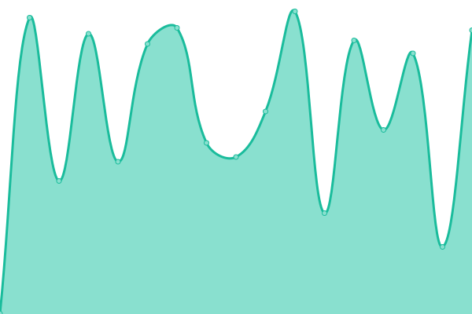

# [📈 Live Status](https://status.ifvlab.com): <!--live status--> **🟧 Partial outage**

This repository contains the open-source uptime monitor and status page for [ifvlaboratory](https://status.ifvlab.com), powered by [Upptime](https://github.com/upptime/upptime).

With [Upptime](https://upptime.js.org), you can get your own unlimited and free uptime monitor and status page, powered entirely by a GitHub repository. We use [Issues](https://github.com/ifvlaboratory/Service-Monitor/issues) as incident reports, [Actions](https://github.com/ifvlaboratory/Service-Monitor/actions) as uptime monitors, and [Pages](https://status.ifvlab.com) for the status page.

<!--start: status pages-->
<!-- This summary is generated by Upptime (https://github.com/upptime/upptime) -->
<!-- Do not edit this manually, your changes will be overwritten -->
<!-- prettier-ignore -->
| URL | Status | History | Response Time | Uptime |
| --- | ------ | ------- | ------------- | ------ |
|  IFVLAB Main server - Transmission | 🟥 Down | [ifvlab-main-server-transmission.yml](https://github.com/ifvlaboratory/Service-Monitor/commits/HEAD/history/ifvlab-main-server-transmission.yml) | 

 507ms
     
 | 

<a href="https://status.ifvlab.com/history/ifvlab-main-server-transmission">97.10%</a>
    

|  IFVLAB Main server - Vaultwarden | 🟥 Down | [ifvlab-main-server-vaultwarden.yml](https://github.com/ifvlaboratory/Service-Monitor/commits/HEAD/history/ifvlab-main-server-vaultwarden.yml) | 

 326ms
     
 | 

<a href="https://status.ifvlab.com/history/ifvlab-main-server-vaultwarden">99.82%</a>
    

|  IFVLAB Main server - Syncthing relay | 🟩 Up | [ifvlab-main-server-syncthing-relay.yml](https://github.com/ifvlaboratory/Service-Monitor/commits/HEAD/history/ifvlab-main-server-syncthing-relay.yml) | 

 204ms
     
 | 

<a href="https://status.ifvlab.com/history/ifvlab-main-server-syncthing-relay">56.85%</a>
    

|  IFVLAB Backup server - Transmission | 🟩 Up | [ifvlab-backup-server-transmission.yml](https://github.com/ifvlaboratory/Service-Monitor/commits/HEAD/history/ifvlab-backup-server-transmission.yml) | 

 231ms
     
 | 

<a href="https://status.ifvlab.com/history/ifvlab-backup-server-transmission">100.00%</a>
    

|  IFVLAB Backup server - API | 🟩 Up | [ifvlab-backup-server-api.yml](https://github.com/ifvlaboratory/Service-Monitor/commits/HEAD/history/ifvlab-backup-server-api.yml) | 

 366ms
     
 | 

<a href="https://status.ifvlab.com/history/ifvlab-backup-server-api">100.00%</a>
    

|  IFVLAB Backup server - Cloud drive | 🟩 Up | [ifvlab-backup-server-cloud-drive.yml](https://github.com/ifvlaboratory/Service-Monitor/commits/HEAD/history/ifvlab-backup-server-cloud-drive.yml) | 

 154ms
     
 | 

<a href="https://status.ifvlab.com/history/ifvlab-backup-server-cloud-drive">100.00%</a>
    

|  IFVLAB Gateway server - Admin | 🟩 Up | [ifvlab-gateway-server-admin.yml](https://github.com/ifvlaboratory/Service-Monitor/commits/HEAD/history/ifvlab-gateway-server-admin.yml) | 

 470ms
     
 | 

<a href="https://status.ifvlab.com/history/ifvlab-gateway-server-admin">100.00%</a>
    

|  IFVLAB Gateway server - AdGuardHome | 🟩 Up | [ifvlab-gateway-server-ad-guard-home.yml](https://github.com/ifvlaboratory/Service-Monitor/commits/HEAD/history/ifvlab-gateway-server-ad-guard-home.yml) | 

 251ms
     
 | 

<a href="https://status.ifvlab.com/history/ifvlab-gateway-server-ad-guard-home">100.00%</a>
    

|  IFVLAB Gateway server - SSH | 🟩 Up | [ifvlab-gateway-server-ssh.yml](https://github.com/ifvlaboratory/Service-Monitor/commits/HEAD/history/ifvlab-gateway-server-ssh.yml) | 

 237ms
     
 | 

<a href="https://status.ifvlab.com/history/ifvlab-gateway-server-ssh">100.00%</a>
    

<!--end: status pages-->

[**Visit our status website →**](https://status.ifvlab.com)

## 📄 License

- Powered by: [Upptime](https://github.com/upptime/upptime)
- Code: [MIT](./LICENSE) © [ifvlaboratory](https://status.ifvlab.com)
- Data in the `./history` directory: [Open Database License](https://opendatacommons.org/licenses/odbl/1-0/)
